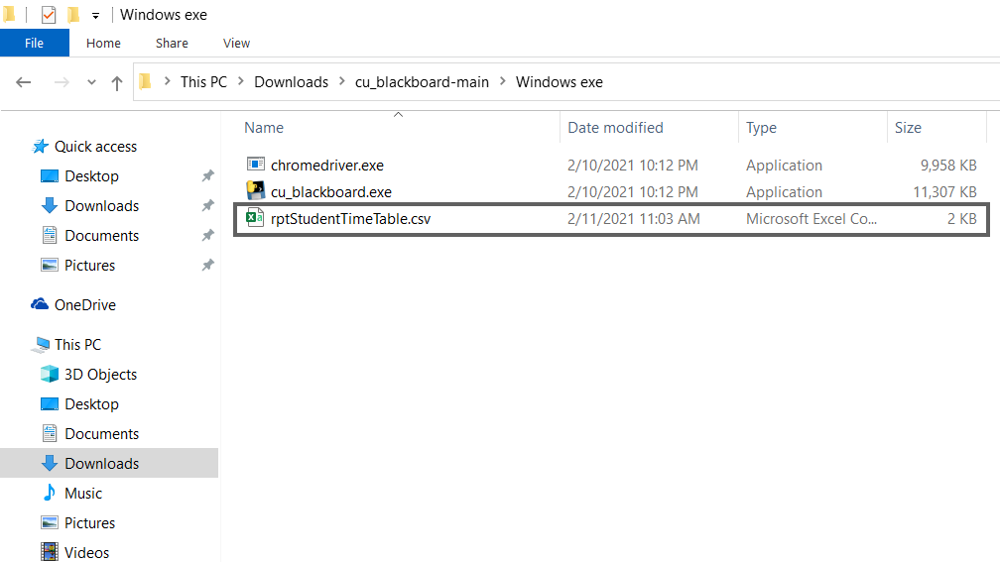
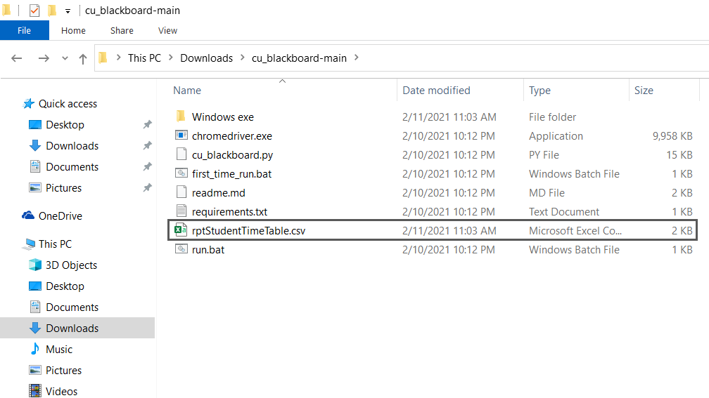

# CU Blackboard:-
It will automatically joins each class of current day and makes count of the total time you are in Lecture. If current class total time is less than 50 minutes than it will join the next class in new tab without closing the current class tab otherwise it will join the next class in new tab and close the current class tab.

## Follow these Steps to run Windows exe File:
1. Download the Project
2. Extract Zip Files
3. Open Extracted Folder
4. Open "Windows exe" Folder
5. Run "cu_blackboard.exe"
6. Enter your Username and Password
7. After that it will extract Time Table from CUIMS

8. Make sure your Folder contains "rptStudentTimeTable.csv" File
9. After this enter from which Lecture you want to join Class and Hit Enter 
10. After this you will see that Your Blackboard is Opened
11. Now, It will automatically join the classes from your entered Lecture
12. After leaving each Lecture it will show you how much time you atteneded the Lecture

## Follow these Steps to run Script Manually:
1. Download the Project
2. Extract Zip Files
3. Open the Extracted Folder
4. If you are using this Project for First time then run "first_time_run.bat"
5. Else run "run.bat"
6. Enter your Username and Password in Command Prompt
7. After that it will extract Time Table from CUIMS

8. Make sure your Folder contains "rptStudentTimeTable.csv" File
9. After this enter in Command Prompt from which Lecture you want to join Class and Hit Enter 
10. After this you will see that Your Blackboard is Opened
11. Now, It will automatically join the classes from your entered Lecture
12. After leaving each Lecture it will show you how much time you atteneded the Lecture

### Note: Google Chrome, Python should be installed on your System and This is only for Educational Purpose.
